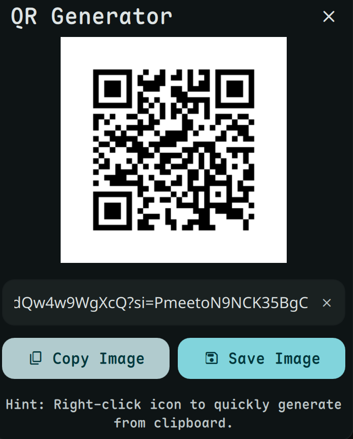

# QR Generator

Generate and scan QR codes instantly.



## Install


**Required:** This plugin requires [dms-common](https://github.com/hthienloc/dms-common) to be installed.

```bash
# 1. Install shared components
git clone https://github.com/hthienloc/dms-common ~/.config/DankMaterialShell/plugins/dms-common

# 2. Install this plugin
dms://plugin/install/qrGenerator
```

Or manually:
```bash
git clone https://github.com/hthienloc/dms-qr-generator ~/.config/DankMaterialShell/plugins/qrGenerator
```

## Features

- **Real-time generation** - QR updates as you type
- **WiFi sharing** - One-click QR for current network
- **Scan QR codes** - Decode from dropped images
- **Clipboard integration** - Right-click to generate from clipboard
- **Privacy focused** - Auto-clears on close

## Usage

| Action | Result |
|--------|--------|
| Left click | Open generator |
| Right click | Paste & generate from clipboard |
| Drop image | Scan QR code |
| Drop text | Generate QR code |

## Requirements

- `qrencode` - QR generation: `sudo dnf install qrencode` / `sudo pacman -S qrencode`
- `zbarimg` - QR scanning (optional): `sudo dnf install zbar` / `sudo pacman -S zbar`

## License

GPL-3.0(https://github.com/hthienloc/dms-common) to be installed in the plugins directory.
